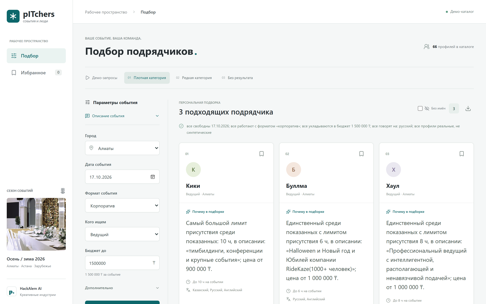
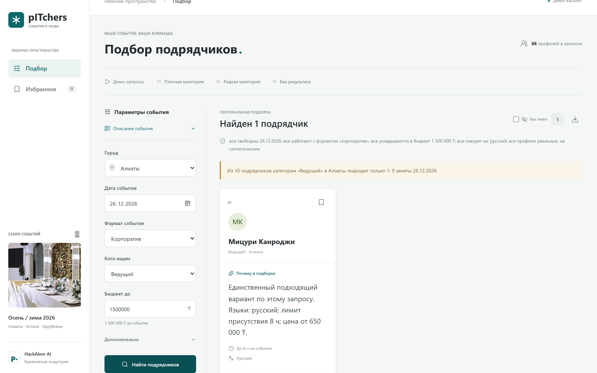
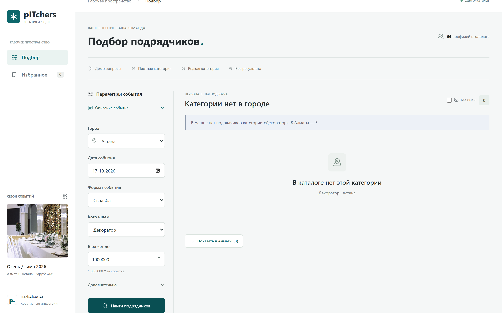

# pITchers — умный подбор event-подрядчиков

HackAlem AI, трек «Креативные индустрии», кейс #79-lite.

Заказчик уже знает город, дату и формат события, но в каталоге слишком много вариантов. Сервис принимает параметры заказа, отбирает до трёх свободных подрядчиков и **объясняет каждый выбор конкретными фактами из их профилей** — с ценой, лимитом часов и цитатой из описания. Если подходящих меньше трёх или нет совсем, сервис честно говорит почему и что изменить.

**Работает без ключа LLM.** `npm ci && npm run preview` поднимает сайт с реальными данными и объяснениями, собранными из фактов каталога. Ключ нужен только для LLM-режима.

```powershell
npm ci
npm run preview     # сайт без внешних вызовов
npm test            # 66 тестов, без сети
npm run demo        # 5 сценариев + проверка детерминизма
```

## Как выглядит

| Подобрали трёх | Осталась одна | Категории нет в городе |
| --- | --- | --- |
|  |  |  |

## Демо-запросы и ожидаемый результат

Все пять воспроизводятся командой `npm run demo`; первые три есть на сайте кнопками «Демо-запросы».

| Запрос | Ожидаемый статус | Что показывает сервис |
| --- | --- | --- |
| Ведущий, Алматы, корпоратив, 17.10.2026, 1 500 000 ₸ | `found` | 3 карточки: «Из 10 подрядчиков категории «Ведущий» в Алматы подходят ровно 3 — показываем всех.» |
| Тот же запрос на 26.12.2026 | `partial` | 1 карточка: «…подходит только 1: 9 заняты 26.12.2026.» |
| Флорист, Алматы, свадьба, 17.10.2026, 500 000 ₸ | `partial` | 1 из 2, второй занят; профиль помечен как синтетический |
| Банкетный зал, Алматы, корпоратив, 19.12.2026, 3 000 000 ₸ | `all_filtered` | 0 карточек: «…не подходит ни один: 7 заняты 19.12.2026. Ближайшая подходящая дата — 16.12.2026.» |
| Декоратор, Астана, свадьба, 17.10.2026, 1 000 000 ₸ | `no_category` | 0 карточек: «В Астане нет подрядчиков категории «Декоратор». В Алматы — 3.» + кнопка «Показать в Алматы (3)» |

Повторный запуск любого запроса даёт тот же порядок карточек и те же баллы — `npm run demo` прогоняет каждый сценарий дважды и печатает «Детерминизм: OK».

## Что реализовано

- **Данные.** 66 профилей из CSV организаторов загружаются в память и нормализуются: списки категорий, форматов и языков, календарь занятости, флаги `synthetic`, `cityImputed`, `priceImputed`. Исходный CSV не меняется.
- **Жёсткие фильтры с причинами.** Порядок фиксирован: занятость → бюджет → формат → язык → часы. Каждый отсеянный получает ровно одну причину — первую непройденную — и конкретную расшифровку: «занят 26.12.2026», «от 2 000 000 ₸ при бюджете 1 500 000 ₸».
- **Детерминированное ранжирование.** Пять компонентов в 0..1: совпадение с описанием 35%, запас бюджета 25%, специализация 15%, часы 15%, качество данных 10%. Округление до 4 знаков, при равенстве баллов — сортировка по `id`.
- **Четыре исхода.** `found` (3 карточки), `partial` (1–2), `all_filtered` (кандидаты есть, но никто не проходит), `no_category` (в этом городе категории нет). У каждого — русское сообщение с конкретными числами.
- **Подсказки и действия.** `nearestFreeDate` (ближайшая дата в ±14 дней), `minBudgetNeeded`, список других городов — и готовые кнопки: «Показать на 16.12.2026», «Показать с бюджетом от 650 000 ₸», «Показать в Алматы (3)».
- **Объяснения.** Один запрос к LLM на все карточки, `temperature 0`, только факты движка — имена и баллы модели не передаются. Ответ валидируется: состав ID, длина, числа, попарная различимость. Невалидный ответ → одна перегенерация → локальный резерв из фактов. Запрос никогда не падает из-за модели.
- **Гарантия различимости.** У каждой показанной карточки есть минимум одно измеримое отличие от остальных: ранг цены, уникальный лимит часов, язык, ширина профиля, лучший компонент рейтинга или слово из описания, которого нет у других.
- **Агентный ввод.** `POST /api/parse` разбирает фразу «Нужен ведущий на корпоратив в Алматы 14 ноября, бюджет 800 тысяч» через function calling со строгими enum из каталога. Не хватает поля — возвращается один уточняющий вопрос. Нет ключа — форма продолжает работать.
- **Сравнение дат.** `POST /api/compare` показывает, кто выпал из выдачи при смене даты и почему.
- **Живая самопроверка.** `GET /api/selfcheck` прогоняет 10 проверок требований кейса на реальных данных и возвращает отчёт.

## Пример проверки

```powershell
npm test                  # 66 тестов: ядро, AI, HTTP, контракты. Без внешних вызовов
npm run demo              # 5 сценариев, статусы и «Детерминизм: OK»
npm start                 # сервер на http://localhost:3000
curl http://localhost:3000/api/selfcheck
```

`GET /api/selfcheck` на текущей версии возвращает 10 из 10:

| Проверка | Результат |
| --- | --- |
| Детерминизм демо №1 | `HK-35215, HK-44733, HK-77838` — оба прогона совпали |
| Все показанные подрядчики свободны | проверено 12 карточек по календарям, занятых 0 |
| Смена даты на 26.12 меняет выдачу | выпали 3, у каждого причина «занят 26.12.2026» |
| Плотная категория | `found`, 3 карточки |
| Редкая категория объяснена | `partial`, 1 карточка, сказано почему |
| Нет категории в городе | `no_category` + другие города |
| Полный отсев с подсказками | `all_filtered` + ближайшая дата |
| Каждый запрос быстрее 10 000 мс | самый медленный сценарий укладывается в предел |
| Объяснения попарно различимы | у всех трёх карточек своё число или цитата |
| Нет запрещённых общих фраз | проверено 8 объяснений, нарушений 0 |

## API

Полные примеры запросов и ответов: [docs/api.md](docs/api.md). Схема пайплайна: [docs/pipeline.md](docs/pipeline.md).

| Метод | Назначение |
| --- | --- |
| `GET /api/meta` | города, категории, форматы, языки, границы календаря, размер каталога |
| `POST /api/recommend` | подбор: тело — `Query`, ответ — `EngineResult` с объяснениями и `elapsedMs` |
| `POST /api/compare` | сравнение двух дат: `{ query, date2 }` |
| `POST /api/parse` | разбор свободного текста в `Query` |
| `GET /api/selfcheck` | отчёт из 10 проверок требований |

```bash
curl -X POST http://localhost:3000/api/recommend \
  -H "Content-Type: application/json" \
  -d '{"city":"Алматы","date":"2026-10-17","eventType":"корпоратив","category":"Ведущий","budget":1500000}'
```

```jsonc
{
  "status": "found",
  "message": "Из 10 подрядчиков категории «Ведущий» в Алматы подходят ровно 3 — показываем всех.",
  "candidatesTotal": 10,
  "excluded": { "busy": 5, "over_budget": 1, "format": 1, "language": 0, "hours": 0 },
  "commonFacts": ["все свободны 17.10.2026", "все работают с форматом «корпоратив»", "…"],
  "cards": [
    {
      "id": "HK-35215", "name": "Кики", "priceFrom": 900000, "score": 0.495,
      "scoreParts": { "relevance": 0.2, "budget": 0.4, "specialization": 1, "hours": 0.5, "dataQuality": 1 },
      "factChips": ["900 000 ₸ — 60% бюджета", "самый доступный из показанных", "больше всех часов — до 10 ч"],
      "explanation": "Самый большой лимит присутствия среди показанных: 10 ч, в описании: «тимбилдинги, конференции и крупные события». Цена от 900 000 ₸.",
      "explanationSource": "llm"
    }
  ],
  "elapsedMs": 2723
}
```

Ошибка валидации возвращает 400 с русским текстом:

```json
{ "error": "Дата 05.01.2027 вне календаря подрядчиков: 23.09.2026 — 31.12.2026." }
```

## Технологии и архитектура

Node.js 24, ES modules, Express 5, `csv-parse`, `dotenv`, SDK `openai`. Фронтенд — HTML, CSS и vanilla JS без сборки, иконки Lucide отдаются локально. Тесты: встроенный `node:test` и Playwright. Базы данных, сборки фронтенда и дообучения модели нет.

```text
CSV → нормализация → кандидаты (город + категория) → жёсткие фильтры с причинами
    → баллы 0..1 → топ-3 + факты и отличия → статус, подсказки, действия
    → объяснения (кэш / LLM с таймаутом / резерв из фактов) → EngineResult
```

| Путь | Назначение | Автор |
| --- | --- | --- |
| `data/contractors.csv` | исходные данные организаторов, не изменяются | — |
| `config/domain.json` | ключевые слова, веса формулы, порядок фильтров | Дамир |
| `src/engine/` | загрузка данных, фильтры, баллы, статусы, факты, сравнение дат | Дамир |
| `src/agent/` | разбор свободного текста через function calling | Дамир |
| `src/api/` | `/api/compare`, `/api/selfcheck` | Дамир, участник 3 |
| `src/ai/` | промпт, валидация ответа, кэш, резервные объяснения | участник 2 |
| `src/server.js` | Express-приложение, таймауты, обработка ошибок | участник 3 |
| `public/` | интерфейс: форма, карточки, причины отсева, избранное | участник 3 |
| `scripts/`, `tests/`, `docs/` | демо, автотесты, документация | Дамир |

Ядро не знает предметной области: ключевые слова, веса и порядок фильтров вынесены в `config/domain.json`. Как перенести сервис на другую нишу — в [docs/pipeline.md](docs/pipeline.md).

## Установка

```powershell
node --version        # нужен Node.js 24
npm ci
node src/engine/data.js   # 66 профилей, 17 категорий — проверка данных
npm run preview           # сайт без ключа
```

Для LLM-режима создайте личный `.env` в корне (шаблон — `.env.example`):

```dotenv
LLM_API_KEY=your-own-key
LLM_BASE_URL=
LLM_MODEL=gpt-4.1-mini
PORT=3000
```

`LLM_BASE_URL` пуст для OpenAI; для NVIDIA — `https://integrate.api.nvidia.com/v1`. Нужна модель с поддержкой Chat Completions, JSON-ответов и `temperature=0`. Поддержаны резервные имена `OPENAI_API_KEY`, `OPENAI_BASE_URL`, `OPENAI_MODEL`. `.env`, `node_modules` и `.cache` не коммитятся. После настройки ключа: `node src/ai/warm-cache.js --refresh`, затем `npm start`.

`explanationSource` в ответе показывает происхождение текста: `llm` — принятый ответ модели, `cache` — сохранённый ответ модели, `template` — локальный резерв из фактов. Шаблоны не кэшируются.

## Данные и внешние сервисы

Датасет организаторов: 66 анонимизированных профилей, 17 категорий, 3 города, календари с 23.09.2026 по 31.12.2026; 13 записей полностью синтетические, у части профилей город или цена восстановлены — всё это помечено флагами и видно на карточке. Движок поддерживает необязательный `data/synthetic.csv` с теми же колонками.

Внешний сервис один — провайдер LLM по вашему ключу. В него уходят только запрос пользователя и факты выбранных карточек: имена, баллы и сырой CSV не передаются. Без ключа сервис работает полностью локально.

## Ограничения

- Свободная дата означает отсутствие занятости в предоставленном календаре, а не подтверждённую бронь. Цена «от» не гарантирует итоговую смету.
- Описания — заявления самих профилей; независимой проверки опыта и отзывов нет.
- Если у карточек совпадают все факты, сервис не придумывает различий, а говорит об этом прямо.
- Повторяемость LLM-текста после перезапуска опирается на файловый кэш. Если кэш удалён, текст может отличаться даже при `temperature=0`; порядок и баллы карточек при этом не меняются.
- Кэш рассчитан на один процесс Node.js, многопроцессной синхронизации нет.
- Предел 10 секунд относится к пользовательскому сценарию: внутри стоят таймауты 8 с на AI и 9 с на сервер, но сеть и загрузка машины тоже влияют.
- Избранное хранится только в localStorage браузера. Бронирования, контактов, уведомлений и аккаунтов нет.
- **Публичного развёртывания нет**: проект запускается локально, ссылки на деплой не существует.
- Фото в боковой панели — иллюстрация сезона, не изображает конкретного подрядчика; источник указан в `public/assets/README.md`.
