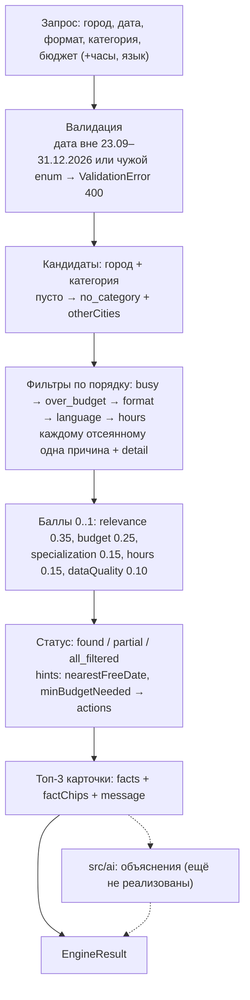

## Как устроен подбор



Движок (`src/engine/`) полностью детерминирован: ни LLM, ни случайности, ни зависимости от текущего времени. `src/ai/` и `src/server.js` на момент этого документа пустые — слой объяснений подключается поверх `EngineResult`, не меняя его.

## Агентный ввод (`src/agent/`)

`POST /api/parse` принимает `{ text, partialQuery }` и разбирает фразу через **function calling**: схема повторяет поля `Query`, а значения `city`, `eventType`, `category`, `language` заданы как **enum из `catalogueFacets()`** — прямо из каталога. Ответ модели дополнительно прогоняется через `sanitize()`: всё, чего нет в каталоге, и дата вне календарного окна отбрасываются как «не сказано», поэтому выдуманная категория до движка не дойдёт. Не хватает обязательного поля — возвращается `missing` и один вопрос на русском («Какой у вас бюджет в тенге?»). Ответы кэшируются по sha256(текст + модель) в `.cache/parse.json`. Нет ключа, недоступен провайдер или таймаут 8 с — `503` с текстом «используйте форму»: подбор продолжает работать через обычную форму. Проверить доступность заранее: `GET /api/parse/status`.

## Детерминизм

- Сортировка по `score desc`, при равенстве — по `id asc`; все компоненты округляются до 4 знаков.
- Контрагенты грузятся из CSV один раз и сортируются по `id`; порядок фильтров зафиксирован.
- У LLM `temperature: 0` плюс кэш по хешу — одна и та же фраза разбирается одинаково.

## Как проверить

```bash
npm run demo
```

Скрипт прогоняет каждый запрос дважды и сверяет порядок `id`; в конце печатает «Детерминизм: OK».

| # | Запрос | Ожидаемый статус |
|---|---|---|
| 1 | Ведущий, Алматы, корпоратив, 2026-10-17, 1 500 000 ₸ | `found` — 3 карточки |
| 2 | то же, но 2026-12-26 | `partial` — 1 карточка, 9 заняты |
| 3 | Флорист, Алматы, свадьба, 2026-10-17, 500 000 ₸ | `partial` — 1 из 2 |
| 4 | Банкетный зал, Алматы, корпоратив, 2026-12-19, 3 000 000 ₸ | `all_filtered` — все 7 заняты, подсказка на 16.12 |
| 5 | Декоратор, Астана, свадьба, 2026-10-17, 1 000 000 ₸ | `no_category` — в Алматы 3 |

## Как применить к другой нише

Ядро не знает ничего про мероприятия: предметная область вынесена в два места.

1. **`data/contractors.csv`** — тот же набор колонок (`id, anon_name, categories, city, price_from_kzt, event_formats, languages, max_hours, busy_dates, description` + флаги `city_imputed`, `price_imputed`, `synthetic`), другое содержимое.
2. **`config/domain.json`** — `keywords` (стемы по каждому значению `event_formats`), `weights` (5 компонентов, сумма строго 1) и `filterOrder` (порядок жёстких фильтров и, значит, приоритет причин отказа).

Пример для репетиторов: `categories` → «Математика», «Физика»; `event_formats` → «ЕНТ», «школьная программа», «олимпиада»; `price_from_kzt` → цена занятия; `max_hours` → длительность слота; `busy_dates` → занятые дни. В конфиг кладём стемы вида `"ЕНТ": ["ент", "тест", "подготов", "балл"]`. Если цена важнее совпадения по описанию — меняем `weights` (например, `budget` 0.35 / `relevance` 0.25), код не трогаем. Убрать фильтр по языку — просто удалить `"language"` из `filterOrder`.

Что придётся править в коде: календарное окно `DATE_WINDOW` в `src/engine/data.js`, русские формулировки `message`, `detail` и `factChips` в `src/engine/recommend.js` (там же склонения городов) и подсказки-вопросы в `src/agent/parse.js`. Сама логика фильтров, баллов, статусов и подсказок остаётся без изменений.
